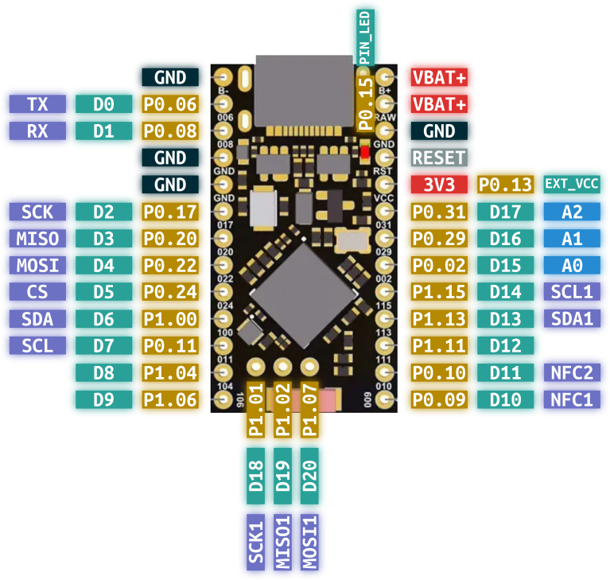
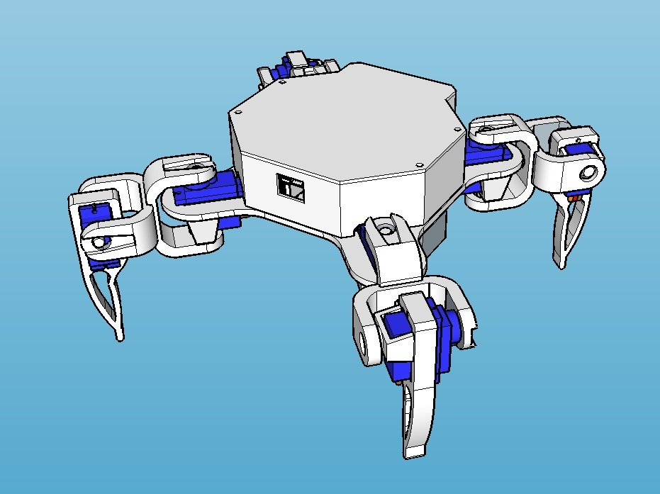

# Zephyr Quadruped

Firmware and hardware resources for a quadruped robot built on Zephyr RTOS (Nordic nRF platform).

This repository contains:
- Zephyr application code
- Custom project modules (leg control, movement controller, BLE peripheral, measurements, power regulation, LEDs)
- Board overlay for Pro Micro nRF52840
- 3D printable model files for the robot body and leg parts

## nRF52840 MCU board


## Project Status

This is an active development project. APIs, module interfaces, and hardware mapping may change.

## Repository Layout

Key paths:

- `src/main.c` - Main application entry point
- `prj.conf` - Zephyr Kconfig options for the app
- `boards/promicro_nrf52840.overlay` - Devicetree overlay for board-specific hardware mapping
- `modules/` - Project-specific modules
- `dts/bindings/` - Custom devicetree bindings
- `3D_model/` - Mechanical model files and print-ready G-code

Main project modules under `modules/`:

- `ble_peripheral` - BLE services and communication
- `leg` - Leg-level actuator abstraction
- `move_controller` - Motion behavior and gait control logic
- `quadruped` - Robot-level coordination and state
- `measurements` - Sensor/telemetry collection
- `voltage_regulator` - Power and voltage handling
- `led` - LED status signaling

## Prerequisites

Recommended environment:

- Nordic nRF Connect SDK (NCS) with Zephyr
- `west` command-line tool
- Zephyr SDK/toolchain (installed by NCS Toolchain Manager)
- A supported debug probe or UF2/bootloader workflow for your board

If you already use nRF Connect for VS Code, ensure the selected SDK/toolchain matches your workspace.

## Build

From repository root:

```bash
west build -b promicro_nrf52840/nrf52840
```

If you need a pristine rebuild:

```bash
west build -p always -b promicro_nrf52840/nrf52840
```

## Flash

After a successful build:

```bash
west flash
```

Notes:
- Flash method depends on your board bootloader/debug setup.
- If you use a custom runner, configure it via Zephyr/NCS runner options.

## Configuration

Primary configuration files:

- `prj.conf` for Kconfig options
- `boards/promicro_nrf52840.overlay` for hardware pin/peripheral mapping

When adding hardware:
- Define/extend devicetree nodes in overlay files
- Add or update bindings in `dts/bindings/` if needed
- Keep module-level Kconfig and CMake in sync

## 3D Models


Mechanical files are included in:

- `3D_model/Quadruped Robot Model 1 - 2540774/files/` (STL source models)
- `3D_model/Quadruped Robot Model 1 - 2540774/g_code/` (pre-sliced G-code)

Included printable parts (based on filenames):

- `Leg.stl` (`1_Leg_x4.gcode`)
- `Servo_leg_MG90.stl` (`1_Servo_leg_MG90_x4.gcode`)
- `Servo_U.stl` (`2_Servo_U_x8.gcode`)
- `U_servo_MG90.stl` (`2_U_servo_MG90_x8.gcode`)
- `Base.stl` (`3_Base_x1.gcode`)
- `Base_MG90.stl` (`3_Base_MG90_x1.gcode`)
- `Battery_cover.stl` (`4_Battery_cover_x1.gcode`)
- `Top_wall.stl` (`5_Top_wall_x1.gcode`)
- `Top_cover.stl` (`6_Top_cover_x1.gcode`)

The quantity hints are encoded in the G-code filenames (for example `x4`, `x8`, `x1`).

### 3D Model Attribution

The bundled model set references:

- "Quadruped Robot Model 1" by Konredus on Thingiverse
- Source URL: https://www.thingiverse.com/thing:2540774

See:
- `3D_model/Quadruped Robot Model 1 - 2540774/README.txt`

Please review and comply with the original model license/terms before redistribution or commercial use.

## Development Notes

- Keep hardware definitions (overlay) aligned with firmware module expectations.
- Prefer small, testable changes to gait/control logic.
- Document any pin remapping or servo orientation changes in this README.

## License

See `LICENSE` for software licensing in this repository.

3D model assets may have separate licensing from the software. Check the model source and included attribution files.